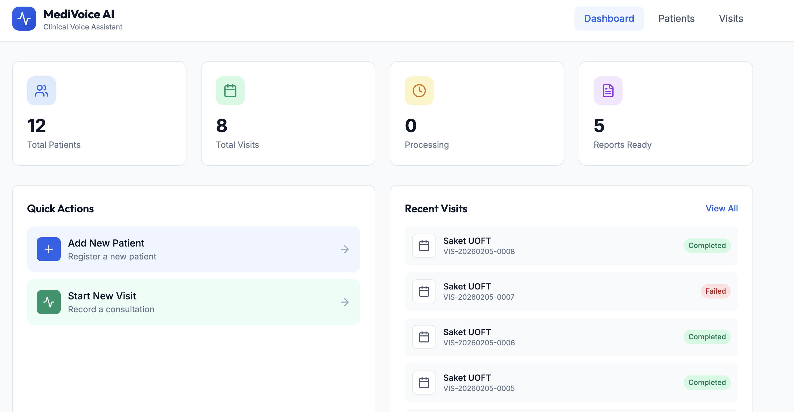

# Clinical AI Assistant

A comprehensive AI-powered tool designed and developed to help healthcare professionals record and document their conversations with patients. This tool significantly reduces operational overhead and burnout faced by doctors while creating notes, summarizing clinical sessions, and maintaining patient history.

## App Demo



🔗 **Live Application**: [https://patient-clinic.preview.emergentagent.com/](https://patient-clinic.preview.emergentagent.com/)

> **Note**: The frontend application and its integration logic are hosted on Emergent. The app allows healthcare providers to record sessions, which are automatically uploaded to the S3 bucket for processing.

## Overview

The Clinical AI Assistant automates the entire workflow of clinical documentation, from recording patient conversations to generating structured medical reports in SOAP format, allowing healthcare professionals to focus more on patient care and treatment.

### System Components

- **Frontend Application**: Web-based interface for recording and managing clinical sessions
- **AWS Backend**: Serverless infrastructure for processing, transcription, and report generation
- **Integration Layer**: Seamless connection between the app and AWS services via S3 bucket uploads

## Key Benefits

- 🩺 **Reduces Doctor & Physician Burnout** - Eliminates tedious manual note-taking during visits
- ⚡ **Automated Report Generation** - Transcribes and summarizes audio clinical sessions automatically
- ⏱️ **Saves 6 Hours Per Day** - Streamlines documentation workflow and administrative tasks
- 📋 **Easy Patient History Management** - Centralized storage with quick access to all visit records
- 📝 **Medical SOAP Format Notes** - Generates standardized clinical documentation (Subjective, Objective, Assessment, Plan)

## Why SOAP Format?

SOAP (Subjective, Objective, Assessment, Plan) is the medical standard for clinical documentation:
- **Subjective**: Chief Complaint, History of Present Illness
- **Objective**: Physical Examination, Review of Systems
- **Assessment**: Diagnosis and Clinical Assessment
- **Plan**: Treatment Plan and Medications

This format ensures consistency, compliance, and allows doctors to focus more on patient care and treatment.

## Architecture

Built on AWS serverless architecture using:
- **AWS HealthScribe**: Medical speech-to-text and clinical documentation
- **AWS Lambda**: Serverless processing functions
- **Amazon S3**: Audio and report storage
- **Amazon SES**: Email notification service
- **AWS CDK**: Infrastructure as Code deployment

## Features

- 🎙️ **Audio Recording**: Capture clinical conversations with dual-channel support
- 📝 **Automatic Transcription**: AI-powered medical transcription using AWS HealthScribe
- 📊 **Structured Reports**: Generate HTML reports with organized clinical sections
- 📧 **Email Notifications**: Automatic delivery of visit summaries to patients
- 🔒 **HIPAA Consideration**: Built on AWS infrastructure with security best practices
- 📱 **Easy Integration**: RESTful API for integration with existing EMR systems

## Project Structure

```
Clinical-AI-Assistant/
├── lambda/                      # Lambda function code
│   ├── healthscribe/           # HealthScribe job management
│   │   └── summarize_conversation.py
│   └── reporting/              # Report generation
│       └── patient_reports.py
├── infra/                      # AWS CDK infrastructure code
│   ├── app.py                  # CDK app entry point
│   └── clinical_ai_assistant_stack.py
└── README.md
```

## Getting Started

### Prerequisites

- AWS Account
- AWS CDK installed (`npm install -g aws-cdk`)
- Python 3.9+
- AWS CLI configured

### Deployment

```bash
# Navigate to infrastructure directory
cd infra

# Install dependencies
pip install -r requirements.txt

# Bootstrap CDK (first time only)
cdk bootstrap

# Deploy the stack
cdk deploy
```

## License

This project is available for educational and evaluation purposes.

## Contact

For questions or collaboration opportunities, please reach out through GitHub.
